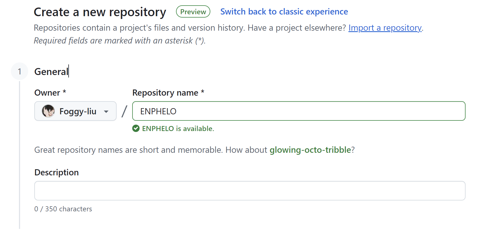
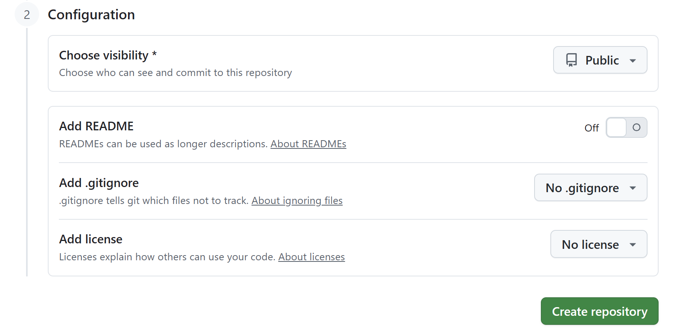

## 8、网页部署

### Github

#### Github仓库

打开[Github网站]( https://github.com/new ) ，在 **Repository name** 里填写你在 安装 Stack 主题 中使用的仓库名，然后点击 **Create repository** 。





#### 将文件上传到Github

因为我们上传文件只需要上传源代码，所以可以在根目录下**创建一个*.gitignore* 文件**，并在文件中添加

```
public
resources
.vscode/
.hugo_build.lock
desktop.ini
```

这样，当后续执行 `git add .` 时，Git 就会自动忽略 `public` 等文件夹，不会把它们加入版本跟踪，最终也就不会上传到 GitHub。

在根目录下打开终端，或者在终端下执行 cd D：HugoSite\根目录，然后依次执行以下命令：

```powershell
git remote add origin https://github.com/Github账号名/刚刚设置的仓库名.git   #关联远程仓库
git add .    # 添加文件
git commit -m "first commit: initial upload of 你的项目名 project"   # 提交，引号里的文字是说明，可自定义
git branch -M main   #  确保分支名
git push -u origin main  # 推送
```

执行完毕之后，如果你以后更新你的网站，那么只需要执行以下命令即可更新你的仓库：

```
git add .
git commit -m "这里写上你的更新说明"
git push
```


git remote add origin https://github.com/Foggy-1iu/ENPHELO.git 
git add .
git commit -m "first commit: initial upload of ENPHELO project"
git branch -M main
git push -u origin main

