+++
date = '2025-08-23T11:08:17+08:00'
draft = false
title = 'Hugo Blog'
description = 'Recording my first experience of building a blog from scratch'
tags = ['Hugo']
image = '/post/first-post/img.png'
comments = true
license = 'false'
math = false
toc = false
style = 'background-color: #ff6b6b; color: white; border-radius: 10px;'
keywords = ["Hugo"]
readingTime = true
+++

# Building a Static Web Blog from Scratch

**A note for Windows users:**

> - Do not use Command Prompt
> - Do not use Windows PowerShell
> - Please run these commands in [PowerShell](https://learn.microsoft.com/en-us/powershell/scripting/install/installing-powershell-on-windows) or a Linux terminal (such as WSL or Git Bash)
>
> PowerShell and Windows PowerShell are [different applications](https://learn.microsoft.com/en-us/powershell/scripting/whats-new/differences-from-windows-powershell?view=powershell-7.3).
>
> Open your terminal and run `$PSVersionTable.PSVersion` to check. If the major version is **7** or higher, you're using the correct newer PowerShell. If it's **5.1**, you're using the older Windows PowerShell.

[PowerShell Download Link](https://learn.microsoft.com/en-us/powershell/scripting/install/installing-powershell-on-windows?view=powershell-7.5)

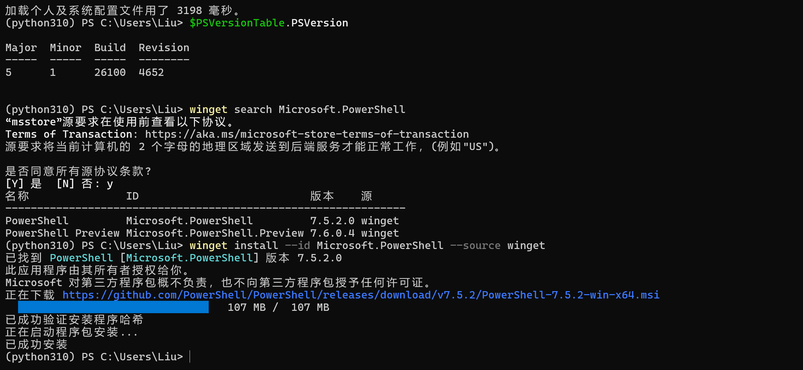

## 1. Installing Hugo

**Steps:**

1. **Install Chocolatey**

   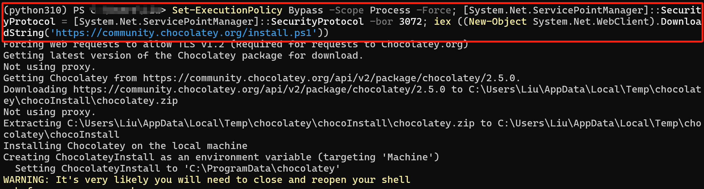

   In the opened administrator PowerShell window, **copy and paste the following command** and execute:

   ```powershell
   Set-ExecutionPolicy Bypass -Scope Process -Force; [System.Net.ServicePointManager]::SecurityProtocol = [System.Net.ServicePointManager]::SecurityProtocol -bor 3072; iex ((New-Object System.Net.WebClient).DownloadString('https://community.chocolatey.org/install.ps1'))
   ```

   Wait for the installation to complete until you see a normal command prompt.

   

2. **Install Hugo (Extended Version)**

   In the **same** administrator PowerShell window, enter:

   ```powershell
   choco install hugo-extended -y
   ```

   Then wait for the installation to succeed.

   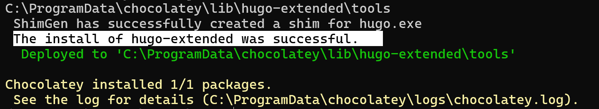

3. **Verify Installation**

   After installation is complete, **close this administrator PowerShell window**.
   Then **open a new regular PowerShell window** (no administrator privileges needed) and enter:

   ```powershell
   hugo version
   ```

   If you see a version number (which should include `+extended`), then it's successful!

   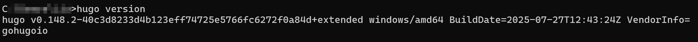

4. **Environment Configuration**

   Modify the system environment variable `PATH`

   `PATH` is a system variable that tells the command line (like PowerShell) where to look for the program corresponding to a command (such as `hugo`) when you enter it in any folder.

   Chocolatey installs Hugo in a fixed location. We need to find it. The usual path is:

   ```plaintext
   C:\ProgramData\chocolatey\lib\hugo-extended\tools
   ```

   Click Settings --> System Information --> Advanced System Settings --> ...

   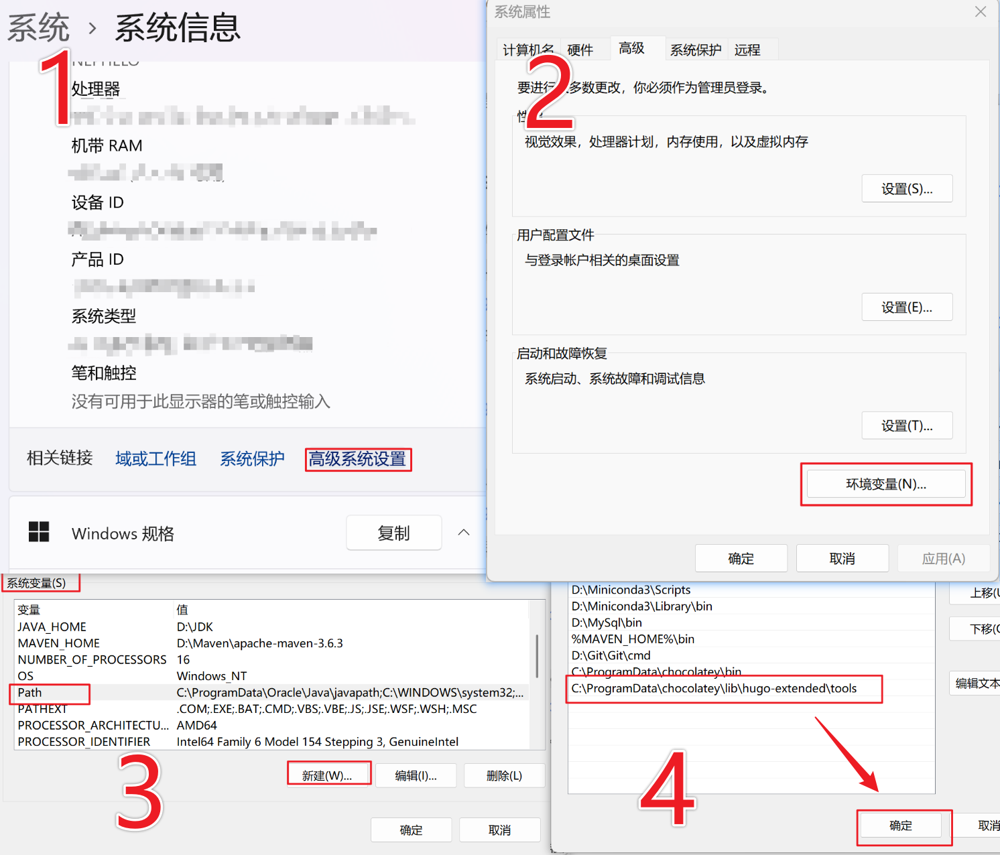

## 2. Creating a Blog

1. **Create a blog project**:

   ```powershell
   hugo new site my-tech-blog     # Create a new site named my-tech-blog
   ```

   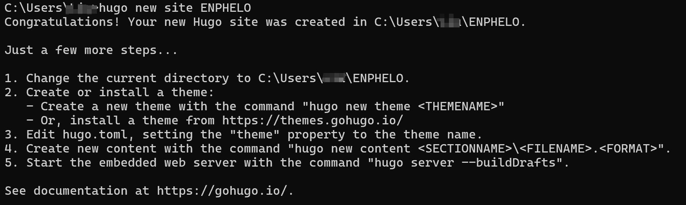

2. **Enter the blog directory**:

   ```powershell
   cd my-tech-blog       # Enter the directory
   ```

3. **Initialize Git**:

   ```powershell
   git init    # Initialize git
   ```

   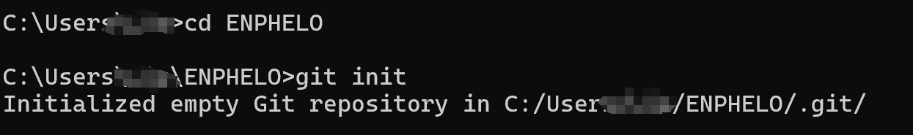

   If you need to migrate the blog location, you can simply find the folder and cut it to the target directory.

## 3. Modifying the Blog Theme

1. **Add a theme** (e.g., Stack theme):

   ```powershell
   git submodule add https://github.com/CaiJimmy/hugo-theme-stack themes/hugo-theme-stack
   ```

   This command will download the theme to your `themes` folder, managed as a git submodule.

   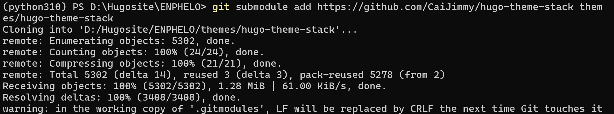

2. **Apply the theme**

   **Case 1:**

   Open the **`hugo.toml`** file in the blog root directory with Notepad, VS Code, or another editor.

   Find the line with `theme` and modify it to:

   ```toml
   theme = "hugo-theme-stack"
   ```

   If it doesn't exist, you can add it. Save the file.

   ------

   **Case 2:**

   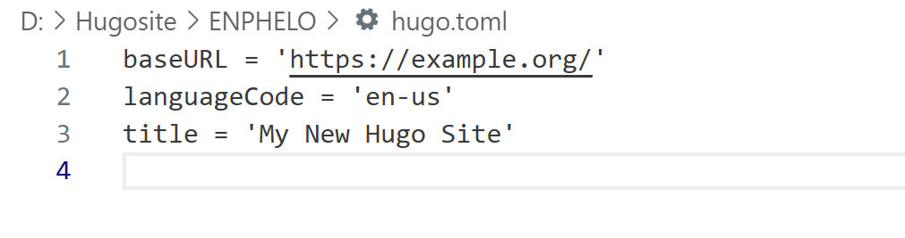

   If what you see is as simplified as mine, follow these steps:

   Run the following command to **overwrite your original `hugo.toml` with the theme's example configuration file**:

   ```bash
   cp themes/hugo-theme-stack/exampleSite/config.yaml ./
   ```

   **This command does two things:**

   1. Copies a fully functional `config.yaml` file from the theme folder to your blog root directory.
   2. **Hugo will prioritize reading `config.yaml` over `hugo.toml`**, so the old simple configuration will naturally become ineffective (you can also delete this file to prevent interference, or back it up in advance if you're unsure).

   ------

   **Case 3:**

   If none of these commands work, use this command to check if the theme downloaded completely:

   ```plaintext
   ls themes/hugo-theme-stack/
   ```

   **Expected result**: You should see a list including folders like `archetypes/`, `exampleSite/`, `layouts/`, etc. If you don't see the `exampleSite` folder, the theme wasn't downloaded completely.

   If it exists, go directly to this file path **D:\Hugosite\ENPHELO\themes\hugo-theme-stack** and find the `config.yaml` file there (it might also be in the exampleSite folder).

   **Copy** this file directly, then **paste** it into your blog root directory `D:\Hugosite\ENPHELO\`.

   **Copy the fully functional `config.yaml` configuration file that comes with the theme to your blog root directory, replacing the previous simple `hugo.toml`.**

3. **Start the server and check the result!**

Now, run the Hugo local server to view your new blog:

```bash
hugo server --buildDrafts
```

Open your browser and visit `http://localhost:1313`, and you should see a very complete and beautiful blog interface instead of the default blank page!

## 4. Example Web Pages

In fact, there is an **example folder** in the themes folder (`themes\hugo-theme-stack\exampleSite`) with some files that creators can reference, such as **hugo.yaml**. You can even **copy them directly to the root directory for use**, and there's no need to worry about these files interfering with project operation. Hugo will **isolate** them during operation (unless the files are copied to the root directory).

You can also check the currently running configuration file with the following command:

```powershell
Get-ChildItem *.yaml, *.toml, *.json
```

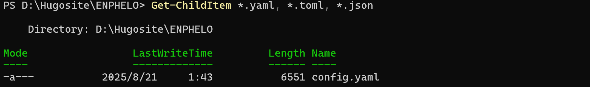

## 5. Writing Blog Posts

After setting up the blog, we can start writing our first blog post.

**File Structure**

Articles are placed in the `content/post` folder, with the following structure:

```plaintext
content
└── post
    └── first-post
        ├── index.md            
        ├── img1.png
        └── img2.png
```

You can create a new article using the following command in the terminal at the root directory:

```powershell
hugo new post/first-post/index.md
```

> **It's best to name it index.md (Hugo-specific), other names will cause many troubles**
>
> Hugo's design references the "default file" rule of web servers (like Apache and Nginx servers which default to finding `index.html` as the folder entry).
>
> - When you place an article in the `content/post/first-post/` folder, Hugo will treat this folder as a "virtual page", and `index.md` is the **content entry** for this page.
> - If it's not named `index.md` (e.g., `first.md`), Hugo can't recognize "this folder is an independent page" and will treat `first.md` as an ordinary article file or page resource, causing **page resources (images, attachments) to fail to associate**.

The generated article content is as follows:

```markdown
+++
date = '2025-08-23T11:08:17+08:00'
draft = true
title = 'First'
+++
```

> The content enclosed in `+++` is Front Matter (preliminary parameters) in TOML format; content enclosed in `---` is in YAML format.

```plaintext
+++
date = '' # Article creation time, automatically generated
draft = true # Whether the article is a draft, true means it's a draft and won't be visible on the webpage, need to set to false or delete this parameter
title = '' # Article title
description = '' # Article description
tags = ['']  # Article categories, such as python, java, etc.
image = '' # Article cover image
comments = true # Whether to allow comments on the article, true for allowed, false for not allowed
license = '' # Page license. If set to false, the license section will be hidden.
math = false # Enable/disable KaTeX rendering
toc = false # Show/hide page table of contents
style = '' # Additional CSS styles for taxonomy term badge that appears in article page.
keywords = [] # Article keywords for SEO
readingTime = true # Show/hide reading time
+++
```

Now that we've created a basic article, we can start writing the content we need. I use the [Typora software](https://typoraio.cn/) for writing. If needed, you can get the installation package from my [github](https://github.com/Foggy-liu).

## 6. Adding Images

Images added directly in Typora are usually placed in the `C:\Users\your username\AppData\Roaming\Typora\typora-user-images` folder, but Hugo uses a different resource folder when loading web pages. You can add images in the following ways:

1. **Place images in the static resource directory**

   - `static/images/` (recommended)

   - `assets/images/` (may use relative paths, e.g.: /images/img1.1.png)

     - Using images in Markdown, VScode code

       ```plaintext
       
       ```

     - Using HTML tags (for more control)

       ```go
       
       ```

   - Recommended directory structure

     ```plaintext
     your-hugo-site/
     ├── content/
     │   └── posts/
     │       └── your-post.md
     ├── static/
     │   └── images/
     │       └── img1.1.png
     └── assets/
         └── images/
             └── img1.1.png
     ```

2. **Using Page Resources**

   - Create `index.md` and an images folder in the article directory:

     content/post/first-post (simple naming, e.g.: img1.1.png)

     ```plaintext
     content/posts/my-post/
     ├── index.md
     └── images/
         └── img1.1.png
     ```

   - Reference in the article:

     ```plaintext
     
     ```

3. Using figure shortcode (if the theme supports it)

   {{&lt; figure src="/images/img1.1.png" title="Image title" &gt;}}

   The first method is recommended: place images in the `static/images/` directory and then reference them using absolute paths in Markdown. I'm using the second method here.

## 7. Image Path Conflicts

Of course, you may encounter conflicts between Typora's image paths and Hugo's image paths. The recommended solution is to change the Typora settings to:

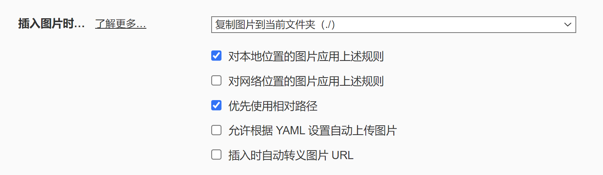

Then you can use `image name.png` for the image path (this step can be ignored if index.md is set).

**Reasons for path conflicts:**

To resolve image path synchronization issues between Hugo and Typora, the core is to make **both use exactly the same relative path**, and the path must be recognizable by both Hugo rendering and Typora local preview. However, Typora and Hugo exist in completely different "worlds" and interpret the same path string very differently.

------

1. Typora's principle: Local file system context

   - **Core goal**: Real-time rendering and display of Markdown documents **on your computer**.

   - **Root directory**: Typora treats the directory where the **currently edited `.md` file is located** as its root directory.

   - Path resolution rules:
     - `` → Looks for `img.png` next to the current `.md` file.
     - `` → Same as above, `./` represents the current directory.
     - `` → Goes up one level from the current directory, then into the `images` folder to find the image.

   - **Workflow**: When you insert an image, Typora expects the path to point to an image file that **actually exists** on your local hard drive; otherwise, it can't load and display it.

   **Typora's perspective**: It only cares about the contents of the`D:\Hugosite\content\posts\my-post\` folder.

2. ------

   Hugo (Stack theme) principle: Web server context

   - **Core goal**: Convert Markdown content into HTML pages for a **website**.

   - **Root directory**: Hugo treats the final website domain (e.g., `https://your-site.com/`) as its root directory. During local debugging, this root directory is `http://localhost:1313/`.

   - Path resolution rules:
     - All paths starting with `/` are considered **"absolute paths"** and are calculated from the **website root directory**.
     - `` → Hugo expects this image to be in your project's `static/` directory, and the final generated link will be `https://your-site.com/img.png`.
     - **For Page Resources**: Modern themes like Stack usually recommend placing images in the same directory as the article and then using Hugo's page resource function. However, ultimately, when Hugo processes Markdown, it still converts paths to absolute URLs based on the website root directory.

   - **Workflow**: When Hugo builds, it doesn't care about your local file paths. It only parses path strings in Markdown and outputs them as-is in the final HTML. Browsers will use this path to request images from the server.

   **Hugo's perspective**: It only cares about resources under the virtual address `https://your-site.com/`.

------

**Conflict scenario simulation**

Suppose your article and image are located as follows:

```plaintext
Your Hugo project/
├── content/
│   └── posts/
│       └── my-post/       <— Typora's "root directory"
│           ├── index.md   <— The file you're editing
│           └── hero.png   <— The image you want to reference
└── static/                <— Hugo maps this to website root /
```

You write the following code in `index.md`:

------

**Writing A: ``**

- **Typora**: ✅ Success! It finds `hero.png` in the `my-post/` folder and displays it.
- **Hugo**: ❌ Failure! It generates the webpage ``. The browser will look for the image at `https://your-site.com/posts/my-post/hero.png`, but this path doesn't exist. The correct URL for the image should be `https://your-site.com/posts/my-post/hero.png` (if using page resources) or `https://your-site.com/...` (if placed in the static directory). This relative path will almost always fail.

------

**Writing B: ``**

- **Typora**: ❌ Failure! It incorrectly tries to find the image in your hard drive's root directory (e.g., `C:\posts\my-post\hero.png`), which obviously doesn't exist.
- **Hugo**: ✅ Success! It generates ``. But this requires you to **also** copy the image to `static/posts/my-post/hero.png` because `/` points to the `static/` folder. This results in content duplication.

------

**Writing C (Stack theme recommendation): Using shortcodes like {{ &lt; figure src="/images/img1.1.png" title="Image title"  &gt;  }}**

- **Typora**: ❌ Failure! Typora doesn't recognize Hugo shortcodes and will only display them as plain text {{&lt; figure ... &gt;}}, making image preview impossible.
- **Hugo**: ✅ Success! The shortcode is processed correctly and the image displays properly.

------

**Summary: Root causes of conflicts**

| Feature              | Typora (editor)                          | Hugo (generator)                                     | Conflict result                               |
| -------------------- | ---------------------------------------- | ---------------------------------------------------- | --------------------------------------------- |
| **Environment**      | Local OS file system                     | Web server virtual environment                       | Completely different path baselines           |
| **Root dir**         | Folder containing `.md` file             | Website domain root (`/`)                            | Opposite interpretations of `/`               |
| **Path type**        | Relative paths preferred                 | Absolute paths (`/` prefix) preferred                | No common path rule works for both            |
| **Dynamic features** | No support for Hugo shortcodes/variables | Relies on shortcodes/variables for advanced features | Can't preview advanced features while editing |

**Conclusion**: It's difficult to find a "perfect" path writing that works natively in both contexts. Therefore, all solutions are **compromises**, either making one side accommodate the other or using tools (like scripts, Typora settings) to bridge the two worlds.

So you may need to choose between **"previewing in Typora and manually modifying paths when publishing"**, **"ensuring correctness in Hugo and giving up real-time preview in Typora"**, or using some **automated conversion tools** to bridge these two worlds.