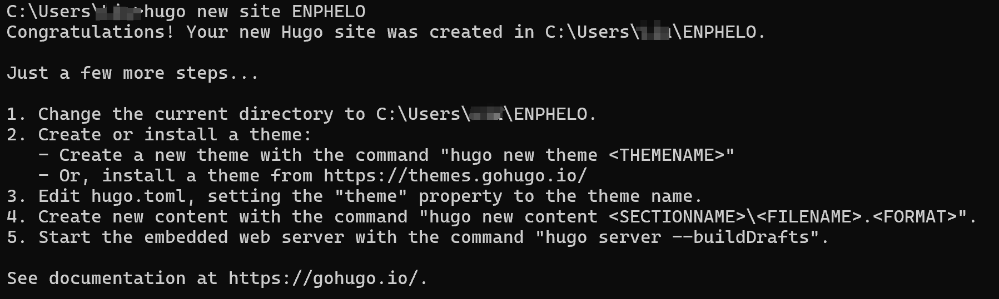

+++
date = '2025-08-23T11:08:17+08:00'
draft = false
title = 'Hugo ブログ '
description = ' 初めて 0 からブログを構築する過程を記録 '
tags = ['Hugo']
image = 'img.png'
comments = true
license = 'false'
math = false
toc = false
style = 'background-color: #ff6b6b; color: white; border-radius: 10px;'
keywords = ["Hugo"]
readingTime = true
+++

# 0 から静的ウェブブログを構築する

**Windows ユーザーへの注意事項：**

> - コマンドプロンプトは使用しないでください
> - Windows PowerShell は使用しないでください
> - [PowerShell](https://learn.microsoft.com/ja-jp/powershell/scripting/install/installing-powershell-on-windows) または Linux 端末（WSL や Git Bash など）でこれらのコマンドを実行してください
>
> PowerShell と Windows PowerShell は[異なるアプリケーション](https://learn.microsoft.com/ja-jp/powershell/scripting/whats-new/differences-from-windows-powershell?view=powershell-7.3)です。
>
> 端末を開いて `$PSVersionTable.PSVersion` を実行して確認してください。メジャーバージョンが**7**以上の場合は、正しい新しい PowerShell を使用しています。**5.1**の場合は、古い Windows PowerShell を使用しています。

[PowerShell ダウンロードリンク](https://learn.microsoft.com/ja-jp/powershell/scripting/install/installing-powershell-on-windows?view=powershell-7.5)


## 1. Hugo のインストール

**手順：**

1. **Chocolatey のインストール**

   

   開いた管理者 PowerShell ウィンドウで、**以下のコマンドをコピーして貼り付け、実行**してください：
   
   ```powershell
   Set-ExecutionPolicy Bypass -Scope Process -Force; [System.Net.ServicePointManager]::SecurityProtocol = [System.Net.ServicePointManager]::SecurityProtocol -bor 3072; iex ((New-Object System.Net.WebClient).DownloadString('https://community.chocolatey.org/install.ps1'))
   ```
   
   正常なコマンドプロンプトが表示されるまで、インストール完了を待ってください。
   
   

2. **Hugo（拡張版）のインストール**

   **同じ**管理者 PowerShell ウィンドウで、次のように入力します：
   
   ```
   choco install hugo-extended -y
   ```
   
   その後、インストールが成功するまで待ってください。
   
   

3. **インストールの確認**

   インストールが完了したら、**この管理者 PowerShell ウィンドウを閉じてください**。
   次に、**新しい一般的な PowerShell ウィンドウを開き**（管理者権限は不要）、次のように入力します：

   ```powershell
   hugo version
   ```
   
   バージョン番号が表示されれば（後ろに `+extended` が付いているはずです）、成功です！

   

4. **環境設定**

   システム環境変数 `PATH` を変更します。

   `PATH`はシステム変数で、コマンドライン（PowerShell など）にコマンド（例：`hugo`）を入力したときに、どのディレクトリでそのコマンドに対応するプログラムを検索するかを指定します。

   Chocolatey は Hugo を固定位置にインストールします。通常のパスは次のとおりです：

   ```plaintext
   C:\ProgramData\chocolatey\lib\hugo-extended\tools
   ```
   
   設定をクリック --> システム情報 --> システムの詳細設定 -->……

   

## 2. ブログの作成

1. **ブログプロジェクトの作成**：


   ```powershell
   hugo new site my-tech-blog     # my-tech-blogという名前の新しいサイトを作成
   ```

  

2. **ブログディレクトリに入る**：

   ```powershell
   cd my-tech-blog       # ディレクトリに入る
   ```

3. **Git の初期化**：

   ```
   git init    # gitを初期化
   ```

   ブログの位置を移動する必要がある場合は、フォルダを見つけて目的のディレクトリに切り取るだけです。

## 3. ブログテーマの変更

1. **テーマの追加**（例：Stack テーマ）：

   ```powershell
   git submodule add https://github.com/CaiJimmy/hugo-theme-stack themes/hugo-theme-stack
   ```
   
   このコマンドは、テーマを`themes`フォルダにダウンロードし、git サブモジュールとして管理します。

   

2. **テーマの適用**

   **ケース 1：**

   メモ帳や VS Code などのエディタで、ブログのルートディレクトリにある **`hugo.toml`** ファイルを開きます。

   `theme`の行を見つけて、次のように変更します：
   
   ```toml
   theme = "hugo-theme-stack"
   ```
   
   存在しない場合は追加し、ファイルを保存してください。

------

   **ケース 2：**

   開いた内容が自分の場合と同じように簡略化されている場合は、以下の手順を実行してください：

次のコマンドを実行して、**元の`hugo.toml`をテーマの例の設定ファイルで上書き**します：


   ```bash
   cp themes/hugo-theme-stack/exampleSite/config.yaml ./
   ```

   **このコマンドは 2 つのことを行います：**

1. テーマフォルダから機能が完全な`config.yaml`ファイルをブログのルートディレクトリにコピーします。
2. Hugo は`hugo.toml`よりも`config.yaml`を優先して読み込む**ので、古い簡単な設定は自然に無効になります（干渉を防ぐためにこのファイルを削除することもできます。不安な場合は事前にバックアップしてください）。

------

**ケース 3：**

これらのコマンドがどれも機能しない場合は、次のコマンドを使用してテーマが完全にダウンロードされているかを確認してください：

   ```plaintext
   ls themes/hugo-theme-stack/
   ```

**期待される結果**：`archetypes/`、`exampleSite/`、`layouts/`などのフォルダが含まれているリストが表示されるはずです。`exampleSite`フォルダが見えない場合は、テーマが完全にダウンロードされていません。

存在する場合は、このファイルパス **D:\Hugosite\ENPHELO\themes\hugo-theme-stack** に直接アクセスし、そこにある`config.yaml`ファイルを探してください（exampleSite フォルダの中にある場合もあります）。

   このファイルを直接**コピー**し、ブログのルートディレクトリ`D:\Hugosite\ENPHELO\`に**貼り付け**てください。

**テーマに付属する機能が完全な`config.yaml`設定ファイルをブログのルートディレクトリにコピーし、以前の簡単な`hugo.toml`を置き換えます。**

3. **サーバーを起動して、効果を確認しましょう！**

さあ、Hugo のローカルサーバーを実行して、新しいブログを表示しましょう：

```bash
hugo server --buildDrafts
```

ブラウザを開いて`http://localhost:1313`にアクセスすると、デフォルトの空白ページではなく、非常に完全で美しいブログ界面が表示されるはずです！

## 4. 実例ページ

実際、themes フォルダには**実例フォルダ**（`themes\hugo-theme-stack\exampleSite`）が存在し、作成者が参考にできるいくつかのファイル（**hugo.yaml**など）が含まれています。これらのファイルは**直接ルートディレクトリにコピーして使用する**こともでき、このフォルダ内のファイルがプロジェクトの実行に干渉することを全く心配する必要はありません。hugo は実行時にこれらのファイルを**隔離**します（ファイルがルートディレクトリにコピーされていない限り）。

次のコマンドを使用して、現在実行中の設定ファイルを確認することもできます：

```powershell
Get-ChildItem *.yaml, *.toml, *.json
```


## 5. ブログの作成

ブログの構築が完了したら、最初のブログ記事の作成を始めることができます。

**ファイル構造**

記事のフォルダは`content/post`フォルダの下に配置され、ファイル構造は次のとおりです：


```plaintext
content
└── post
    └── first-post
        ├── index.md            
        ├── img1.png
        └── img2.png
```

ルートディレクトリで端末を開き、次のコマンドを使用して新しい記事を作成できます：


```powershell
hugo new post/first-post/index.md
```

> **index.md と命名するのが最善です（hugo 特有）。他の名前を使用すると多くの問題が発生します**
>
> Hugo の設計は、**Web サーバーの「デフォルトファイル」規則**（Apache、Nginx サーバーがフォルダの入口として`index.html`をデフォルトで検索するなど）を参考にしています。
>
> - 記事を`content/post/first-post/`フォルダに配置すると、Hugo はこのフォルダを「仮想ページ」と見なし、`index.md`がこのページの**コンテンツ入口**になります。
> - `index.md`と名付けない場合（例：`first.md`）、Hugo は「このフォルダが独立したページである」ことを認識できず、`first.md`を通常の記事ファイルまたはページリソースとして扱い、**ページリソース（画像、添付ファイル）が関連付けできない**問題を引き起こします。

生成された記事の内容は次のとおりです：


```markdown
+++
date = '2025-08-23T11:08:17+08:00'
draft = true
title = 'Frist'
+++
```

> `+++`で囲まれた内容は Front Matter（前置パラメータ）で、形式は TOML です。`---`で囲まれた内容は YAML 形式です。

```plaintext
+++
date = '' # 記事の作成時間、自動的に生成されます
draft = true # 記事が草稿かどうか、trueの場合はウェブページに表示されません。falseに設定するかこのパラメータを削除する必要があります
title = '' # 記事のタイトル
description = '' # 記事の説明
tags = ['']  # 記事の分類、python、javaなど
image = '' # 記事のカバー画像
comments = true # 記事にコメントを許可するかどうか、trueは許可、falseは不許可
license = '' # ページのライセンス。falseに設定すると、ライセンス部分が非表示になります。
math = false # KaTeXレンダリングの有効/無効
toc = false # ページの目次の表示/非表示
style = '' # 記事ページに表示される分類用バッジの追加CSSスタイル。
keywords = [] # SEOのための記事のキーワード
readingTime = true # 読書時間の表示/非表示
+++
```

上記で基本的な記事を作成しました。次に、必要な内容を書くことができます。ここでは[Typroa ソフトウェア](https://typoraio.cn/)を使用して作成しています。必要があれば、私の[github](https://github.com/Foggy-liu)からインストールパッケージを入手できます。

## 6. 画像の追加

Typroa で直接追加された画像は通常`C:\Users\ユーザー名\AppData\Roaming\Typora\typora-user-images`フォルダに配置されますが、hugo がウェブページをロードするときに使用するリソースフォルダはこれとは異なります。以下の方法で画像を追加できます：

1. **画像を静的リソースディレクトリに配置**

   - `static/images/` (推奨)

   - `assets/images/` (相対パスを使用する場合があります。例：/images/img1.1.png)

     - Markdown で画像を使用する場合、VScode コード

       ```plaintext
       
       ```
       
     - HTML タグを使用する場合（より多くの制御が可能）

       ```go
       
       ```
   
      - 推奨されるディレクトリ構造
   
        ```text
         your-hugo-site/
         ├── content/
         │   └── posts/
         │       └── your-post.md
         ├── static/
         │   └── images/
         │       └── img1.1.png
         └── assets/
             └── images/
                 └── img1.1.png
        ```
   
2. **Page Resources を使用**

   - 記事ディレクトリに`index.md`と画像フォルダを作成します：

     content/post/first-post（簡単な命名、例：img1.1.png）
     
     ```
      content/posts/my-post/
      ├── index.md
      └── images/
          └── img1.1.png
     ```
   
      - 記事中で引用する場合：
   
        ```
        
        ```
   
3. figure ショートコードを使用する（テーマがサポートしている場合）

   {{ &lt;  figure src="/images/img1.1.png" title="画像のタイトル"  &gt;  }} 

   最初の方法を推奨します。画像を`static/images/`ディレクトリに配置し、Markdown で絶対パスを使用して引用します。ここでは 2 番目の方法を使用しています。

## 7. 画像パスの競合

もちろん、ここで遭遇する問題は Typroa の画像パスと Hugo の画像パスが競合する問題です。推奨される解決策は、Typroa の設定を次のように変更することです：


その後、画像パスに`画像名.png`を使用するだけです（index.md を設定している場合は、この手順を無視できます）。

**パスが競合する原因は以下のとおりです：**

Hugo と Typora 間の画像パスの同期問題を解決するには、**両者が完全に一致する相対パスを使用**し、そのパスが Hugo のレンダリングと Typora のローカルプレビューの両方で認識できるようにすることが核心です。しかし、Typora と Hugo は完全に異なる「世界」に存在し、同じパス文字列に対して非常に異なる解釈をします。

------

1. Typora の原理：ローカルファイルシステムコンテキスト

   - **核心目標**：**あなたのコンピュータ上で**Markdown 文書をリアルタイムでレンダリングして表示すること。

   - **ルートディレクトリ**：Typora は**現在編集している`.md`ファイルが存在するディレクトリ**をルートディレクトリと見なします。

   - パス解析規則：

     - `` → 現在の`.md`ファイルの隣に`img.png`を探します。
     - `` → 上記と同じ、`./`は現在のディレクトリを表します。
     - `` → 現在のディレクトリの上の階層に移動し、`images`フォルダに入って画像を探します。

   - **ワークフロー**：画像を挿入するとき、Typora はパスがローカルハードディスク上に**実際に存在する**画像ファイルを指していることを期待しています。そうでない場合は、ロードして表示することができません。

   **Typora の視点**：`D:\Hugosite\content\posts\my-post\`フォルダ内のものだけを気にします。

2. ------

   Hugo (Stack テーマ) の原理：Web サーバーコンテキスト

   - **核心目標**：Markdown コンテンツを**ウェブサイト**の HTML ページに変換すること。


   - **ルートディレクトリ**：Hugo は最終的に生成されるウェブサイトのドメイン（例：`https://your-site.com/`）をルートディレクトリと見なします。ローカルでデバッグする場合、このルートディレクトリは`http://localhost:1313/`です。


   - パス解析規則：

     - `/`で始まるすべてのパスは **「絶対パス」** と見なされ、**ウェブサイトのルートディレクトリ**から計算されます。
     - `` → Hugo はこの画像がプロジェクトの`static/`ディレクトリに存在することを期待し、最終的に生成されるリンクは`https://your-site.com/img.png`になります。
     - **ページリソースについて**：Stack のような現代的なテーマでは、通常、画像を記事と同じディレクトリに配置し、Hugo のページリソース機能を使用することを推奨しています。しかし、最終的に Hugo が Markdown を処理するときは、パスをウェブサイトのルートディレクトリに基づく絶対 URL に変換します。
     
   - **ワークフロー**：Hugo のビルド時には、ローカルファイルのパスは考慮されません。Markdown 内のパス文字列を解析し、最終的な HTML にそのまま出力するだけです。ブラウザはこのパスを使用してサーバーに画像を要求します。

   **Hugo の視点**：`https://your-site.com/`という仮想アドレスの下にあるリソースだけを気にします。

------

**競合シナリオのシミュレーション**

記事と画像の位置が次のようになっていると仮定します：

```plaintext
あなたのHugoプロジェクト/
├── content/
│   └── posts/
│       └── my-post/       <— Typoraの「ルートディレクトリ」
│           ├── index.md   <— 編集中のファイル
│           └── hero.png   <— 引用したい画像
└── static/                <— Hugoはこれをウェブサイトのルート / にマッピング
```

あなたは`index.md`に次のコードを書きました：

------

**記法 A: ``**

- **Typora**：✅ 成功！`my-post/`フォルダで`hero.png`を見つけて表示します。
- **Hugo**：❌ 失敗！ウェブページ``を生成します。ブラウザは`https://your-site.com/posts/my-post/hero.png`という URL で画像を探しますが、このパスは存在しません。画像の正しい URL は（ページリソースを使用する場合は）`https://your-site.com/posts/my-post/hero.png`または（static ディレクトリに配置する場合は）`https://your-site.com/...`です。この相対パスはほとんどの場合エラーになります。

------

**記法 B: ``**

- **Typora**：❌ 失敗！誤ってハードドライブのルートディレクトリ（例：`C:\posts\my-post\hero.png`）で画像を探そうとしますが、明らかに見つかりません。
- **Hugo**：✅ 成功！``を生成します。但し、`/`が`static/`フォルダを指しているため、画像を`static/posts/my-post/hero.png`にも**コピーする必要があります**。これによりコンテンツの重複が発生します。

------

**記法 C (Stack テーマ推奨): {{ &lt; figure src="/images/img1.1.png" title="画像のタイトル"  &gt; }} などのショートコードを使用**

- **Typora**：❌ 失敗！Typora は Hugo のショートコードを認識せず、単なるテキスト {{ &lt; figure ... &gt; }} として表示するだけで、画像をプレビューできません。
- **Hugo**：✅ 成功！ショートコードが正しく処理され、画像が正しく表示されます。

------

**まとめ：競合の根本原因**

| 特性                   | Typora (エディタ)                                  | Hugo (ジェネレータ)                                | 競合結果                                   |
| ---------------------- | -------------------------------------------------- | -------------------------------------------------- | ------------------------------------------ |
| **作業環境**           | ローカルオペレーティングシステムのファイルシステム | Web サーバーの仮想環境                             | パスの基準が完全に異なる                   |
| **ルートディレクトリ** | `.md`ファイルが存在するフォルダ                    | ウェブサイトのドメインルート (`/`)                 | `/`の解釈が逆である                        |
| **パスの種類**         | 相対パスが**推奨**され、**デフォルト**             | 絶対パス（`/`で始まる）が**推奨**                  | 同じパス規則を使用できない                 |
| **動的機能**           | Hugo のショートコード、変数をサポートしない        | 高級機能を提供するためにショートコード、変数に依存 | 編集時に高級機能の効果をプレビューできない |

**結論**：両方のコンテキストでネイティブに機能する「完璧な」パス記法を見つけることは困難です。したがって、すべての解決策は**妥協案**であり、一方を他方に適応させるか、ツール（スクリプト、Typora 設定など）を使用してこの 2 つの世界を橋渡しするかのいずれかです。

したがって、「Typora でプレビューし、公開時に手動でパスを変更する」か、「Hugo で正確性を保証し、Typora のリアルタイムプレビューを放棄する」か、またはこれら 2 つの世界を橋渡しするための**自動化された変換ツール**を使用するかを選択する必要がある場合があります。