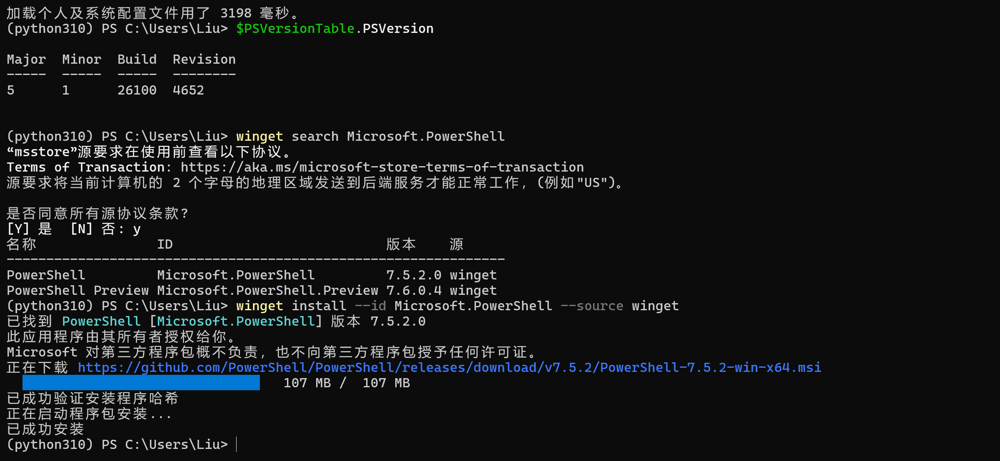
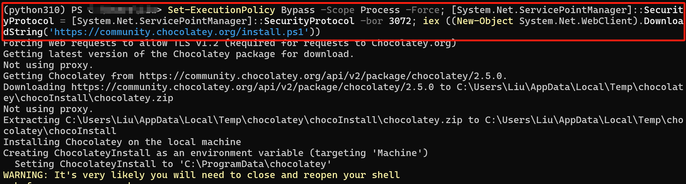
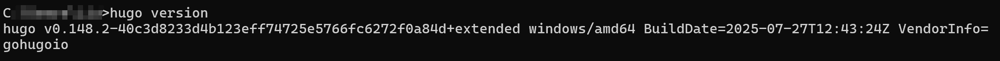
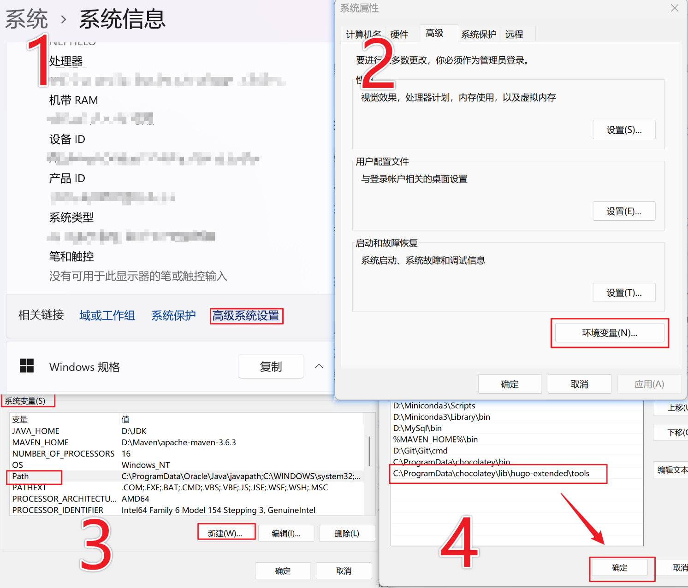
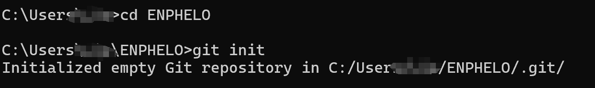
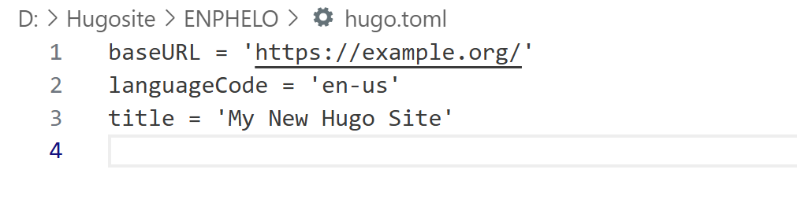
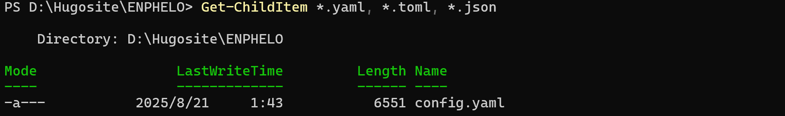
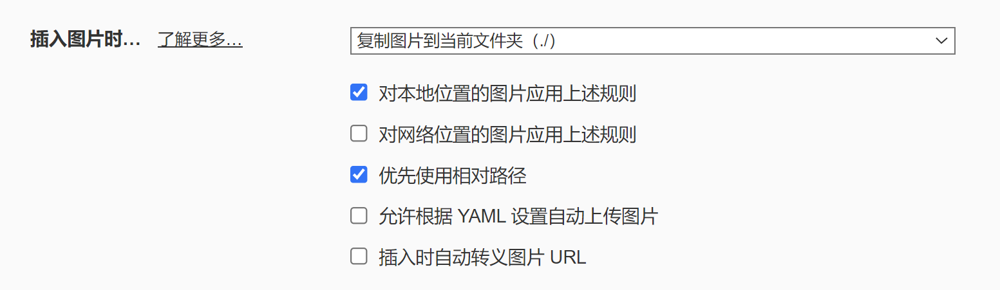

+++
date = '2025-08-23T11:08:17+08:00'  # 文章创建时间，这个会自动生成
draft = false  # 文章是否为草稿，true为草稿，此时网页不展示文章，将其设为false或者删除这个参数
title = 'Hugo博客'     #  文章标题
description = '记录自己第一次从0开始建博客'   # 文章描述
tags = ['Hugo']   # 文章标签
image = '/post/first-post/img.png'  # 文章图片
comments = true # 文章是否允许评论，true为允许，false为不允许
license = 'false' # 页面的许可证。如果设置为false，许可证部分将被隐。
math = false # 启用/禁用 KaTeX 渲染
toc = false # 显示/隐藏页面的目录
style = 'background-color: #ff6b6b; color: white; border-radius: 10px;'   # 用于自定义CSS样式的参数
keywords = ["Hugo"] # 文章的关键字，用于SEO
readingTime = true # 显示/隐藏阅读时间

+++

# 从0搭建一个静态网页博客

**前情提示——如果您是Windows用户：**

> - 不要使用命令提示符
> - 不要使用 Windows PowerShell
> - 请在 [PowerShell](https://learn.microsoft.com/en-us/powershell/scripting/install/installing-powershell-on-windows) 或 Linux 终端（如WSL或Git Bash）中运行这些命令
>
> PowerShell 和 Windows PowerShell [是不同的应用程序](https://learn.microsoft.com/en-us/powershell/scripting/whats-new/differences-from-windows-powershell?view=powershell-7.3)。
>
> 打开终端并运行 `$PSVersionTable.PSVersion` 来检查。如果主要版本是 **7** 或更高，那您使用的是正确的新版 PowerShell。如果是 **5.1**，那么使用的是旧的 Windows PowerShell。

[PowerShell下载链接](https://learn.microsoft.com/en-us/powershell/scripting/install/installing-powershell-on-windows?view=powershell-7.5)



## 1、安装Hugo

**步骤：**

1. **安装Chocolatey**

   

   在打开的管理员PowerShell窗口中，**复制粘贴并执行以下命令**：

   ```powershell
   Set-ExecutionPolicy Bypass -Scope Process -Force; [System.Net.ServicePointManager]::SecurityProtocol = [System.Net.ServicePointManager]::SecurityProtocol -bor 3072; iex ((New-Object System.Net.WebClient).DownloadString('https://community.chocolatey.org/install.ps1'))
   ```

   等待安装完成，直到出现正常的命令提示符。

   

2. **安装 Hugo (扩展版)**

   在**同一个**管理员PowerShell窗口中，输入：

   ```powershell
   choco install hugo-extended -y
   ```

   随后等待安装成功

   

3. **验证安装**

   安装完成后，**关闭这个管理员PowerShell窗口**。
   然后**重新打开一个普通的PowerShell窗口**（不需要管理员权限），输入：

   ```powershell
   hugo version
   ```

   如果看到版本号（后面应该带有 `+extended`），就说明成功了！

   

4. **环境配置**

   修改系统环境变量 `PATH`

   `PATH` 是一个系统变量，它告诉命令行（如 PowerShell）当你在任何文件夹输入一个命令（如 `hugo`）时，应该去哪些目录里寻找这个命令对应的程序。

   Chocolatey 将 Hugo 安装在了一个固定位置，我们需要找到它。通常路径是：

   ```
   C:\ProgramData\chocolatey\lib\hugo-extended\tools
   ```

   点击设置 --> 系统信息 --> 高级系统设置 -->……  

   

## 2、创建博客

1. **创建博客项目**：

   ```powershell
   hugo new site my-tech-blog     #创建一个名为 my-tech-blog 的新站点
   ```

   

2. **进入博客目录**：

   ```powershell
   cd my-tech-blog       # 进入目录
   ```

3. **初始化Git**：

   ```powershell
   git init    # 初始化 git
   ```

   

   如果需要迁移博客位置，可以直接找到文件夹剪切到目标目录即可

## 3、修改博客主题

1. **添加主题**（例如Stack主题）：

   ```powershell
   git submodule add https://github.com/CaiJimmy/hugo-theme-stack themes/hugo-theme-stack
   ```

   这个命令会把主题下载到你的 `themes` 文件夹里，作为git子模块管理。

   

2. **应用主题**

   **情况一：**

   用记事本或VS Code等编辑器打开博客根目录下的 **`hugo.toml`** 文件。

   找到 `theme` 这一行，把它修改为：

   ```toml
   theme = "hugo-theme-stack"
   ```

   如果没有即可添加，保存文件。

   ------

   **情况二：**

   

   如果打开跟我一样是这样简略的结果，则进行以下步骤：

   运行以下命令，**用主题的示例配置文件覆盖你原来的 `hugo.toml`**：

   ```bash
   cp themes/hugo-theme-stack/exampleSite/config.yaml ./
   ```

   **这个命令做了两件事：**

   1. 从主题文件夹里复制了一个功能完整的 `config.yaml` 文件到你的博客根目录。
   2. **Hugo 会优先读取 `config.yaml` 而不是 `hugo.toml`**，所以旧的简陋配置自然就失效了（也可以将这个文件删除，防止干扰，如果觉得不保险可以提前备份一下）。

   ------

   **情况三：**

   如果这些命令都没有用，则使用这个命令查看主题是否下载完整：

   ```
   ls themes/hugo-theme-stack/
   ```

   **预期结果**：你应该能看到包含 `archetypes/`, `exampleSite/`, `layouts/` 等文件夹的列表。如果看不到 `exampleSite` 文件夹，说明主题没有完整下载。

   如果存在，则直接去这个文件中 **D:\Hugosite\ENPHELO\themes\hugo-theme-stack\**找到里面的 `config.yaml` 文件（也可能在exampleSite文件夹里面）。

   直接**复制**这个文件，然后**粘贴**到你的博客根目录 `D:\Hugosite\ENPHELO\` 下。

   **把主题自带的、功能完整的 `config.yaml` 配置文件复制到你的博客根目录，替换掉之前简单的 `hugo.toml`。**

3.  **启动服务器，查看效果！**

现在，运行 Hugo 本地服务器来查看你的新博客：

```bash
hugo server --buildDrafts
```

打开浏览器访问 `http://localhost:1313`，你应该就能看到一个非常完整、美观的博客界面了，而不是默认的空白页！

## 4、实例网页

其实在themes文件夹中存在着一个**实例文件夹**（`themes\hugo-theme-stack\exampleSite`）里面有一些文件可以供创作者参考，例如**hugo.yaml**，甚至可以**直接复制到根目录使用**，并且完全不用担心这个文件夹中的文件对项目运行产生干扰，hugo在运行的时候会将其**隔离**（除非文件被复制到根目录下）

也可也通过以下命令来查看当前运行的配置文件：

```powershell
Get-ChildItem *.yaml, *.toml, *.json
```



## 5、编写博客

在搭建完博客之后我们可以开始编写自己的第一篇博客文章

**文件结构**

文章的文件夹是放在`content/post`文件夹下的，文件结构如下：

```
content
└── post
    └── first-post
        ├── index.md            
        ├── img1.png
        └── img2.png
```

可以在根目录打开终端使用一下命令创建一个新的文章：

```powershell
hugo new post/first-post/index.md
```

> **最好命名为index.md（hugo特定），其他命名会带来很多麻烦**
>
> Hugo 设计参考了 **网站服务器的 “默认文件” 规则**（比如 Apache、Nginx 服务器默认找 `index.html` 作为文件夹入口）。
>
> - 当你把文章放在 `content/post/first-post/` 文件夹里，Hugo 会把这个文件夹视为一个 “虚拟页面”，`index.md` 就是这个页面的**内容入口**。
> - 如果不叫 `index.md`（比如叫 `first.md` ），Hugo 无法识别 “这个文件夹是一个独立页面”，会把 `first.md` 当普通文章文件或者是页面资源，导致 **页面资源（图片、附件）无法关联**

生成后的文章内容如下：

```markdown
+++
date = '2025-08-23T11:08:17+08:00'
draft = true
title = 'Frist'
+++
```

> `+++`围起来的内容就是 Front Matter（前置参数），格式是TOML；`---`围起来的内容格式是YAML。

```
+++
date = '' # 文章创建时间，这个会自动生成
draft = true # 文章是否为草稿，true为草稿，此时你在网页中是看不到这篇文章的，需要将其设为false或者删除这个参数
title = '' # 文章标题
description = '' # 文章简介
tags = ['']  # 文章分类，比如说python、java等类
image = '' # 文章封面图片
comments = true # 文章是否允许评论，true为允许，false为不允许
license = '' # 页面的许可证。如果设置为false，许可证部分将被隐。
math = false # 启用/禁用 KaTeX 渲染
toc = false # 显示/隐藏页面的目录
style = '' # Additional CSS styles for taxonomy term badge that appears in article page.
keywords = [] # 文章的关键字，用于SEO
readingTime = true # 显示/隐藏阅读时间
+++
```

从上面我们创建了一个基本文章，接下来可以在里面编写你所需要的内容了，我这里是使用[Typroa软件](https://typoraio.cn/)来编写的，如果需要可以通过我的[github](https://github.com/Foggy-liu)获取安装包。

## 6、图片的添加

在Typroa中直接添加的图片一般会放置在`C:\Users\你的用户名\AppData\Roaming\Typora\typora-user-images`文件夹中，但是hugo加载网页的时候使用的资源文件夹与这个不同，你可以通过以下几种方法添加图片：

1. **将图片放在静态资源目录**

   - `static/images/` (推荐)

   - `assets/images/` (可能是相对路径，例如：/images/img1.1.png)

     - 在 Markdown 中使用图片，VScode代码

       ```
       
       ```

     - 使用 HTML 标签（更多控制）

       ```go
       
       ```

   - 组织目录结构建议

     ```text
     your-hugo-site/
     ├── content/
     │   └── posts/
     │       └── your-post.md
     ├── static/
     │   └── images/
     │       └── img1.1.png
     └── assets/
         └── images/
             └── img1.1.png
     ```

2. **使用 Page Resources**

   - 在文章目录创建 `index.md` 和图片文件夹：

     content/post/first-post（简单命名，例如：img1.1.png）

     ```
     content/posts/my-post/
     ├── index.md
     └── images/
         └── img1.1.png
     ```

   - 在文章中引用：

     ```
     
     ```

3. 使用 figure 短代码（如果主题支持）

   {{&lt; figure src="/images/img1.1\.png" title="图片标题" &gt;}}

   推荐使用第一种方法，将图片放在 `static/images/` 目录下，然后在 Markdown 中使用绝对路径引用。我这里使用的是第二种方法。

## 7、图片路径冲突

当然在这里也会遇到的问题就是Typroa的图片路径和Hugo图片路径产生冲突问题。推荐使用方法就是将Typroa设置更改为：



随后图片路径使用`图片命名.png`即可（如果设置了index.md，这一步可以忽略不记）

**路径产生冲突的原因如下：**

要解决 Hugo 和 Typora 之间的图片路径同步问题，核心是让**两者使用完全一致的相对路径**，且路径能同时被 Hugo 渲染和 Typora 本地预览识别。但是Typora 和 Hugo 生活在两个完全不同的“世界”里，对同一个路径字符串有着截然不同的解读。

------

   1.  Typora 的原理：本地文件系统上下文
   
      *   **核心目标**：在**你的电脑上**实时渲染和显示 Markdown 文档。
      *   **根目录 (Root)**：Typora 将**当前正在编辑的 `.md` 文件所在的目录**视为其根目录。
      *   **路径解析规则**：
          *   `` → 在当前 `.md` 文件旁边寻找 `img.png`。
          *   `` → 同上，`./` 代表当前目录。
          *   `` → 到当前目录的上一级，然后进入 `images` 文件夹寻找图片。
      *   **工作流程**：当你插入图片时，Typora 期望路径指向一个你本地硬盘上**确确实实存在**的图像文件，否则它就无法加载和显示。
   
      **Typora 的视角**：它只关心 `D:\Hugosite\content\posts\my-post\` 这个文件夹里的东西。
   
   2. ------
   
      Hugo (Stack主题) 的原理：Web服务器上下文 
   
      *   **核心目标**：将 Markdown 内容转换为**网站**的 HTML 页面。
      *   **根目录 (Root)**：Hugo 将最终生成的网站域名（如 `https://your-site.com/`）视为其根目录。在本地调试时，这个根目录是 `http://localhost:1313/`。
      *   **路径解析规则**：
          *   所有以 `/` 开头的路径都被视为 **“绝对路径”** ，并从**网站根目录**开始计算。
          *   `` → Hugo 会期望这张图片位于你项目的 `static/` 目录下，最终生成的链接是 `https://your-site.com/img.png`。
          *   **对于页面资源 (Page Resources)**：像 Stack 这样的现代主题，通常推荐将图片放在文章同级目录，然后使用Hugo的页面资源功能。但最终，Hugo 在处理 Markdown 时，还是会将路径转换为基于网站根目录的绝对 URL。
      *   **工作流程**：Hugo 构建时，它并不关心你本地文件的路径。它只解析 Markdown 中的路径字符串，并将其原样输出到最终的 HTML 中。浏览器会拿着这个路径去向服务器请求图片。
      
      **Hugo 的视角**：它只关心 `https://your-site.com/` 这个虚拟地址下的资源。

---

   **冲突场景模拟**

   假设你的文章和图片位置如下：
   ```
   你的Hugo项目/
   ├── content/
   │   └── posts/
   │       └── my-post/       <— Typora 的“根目录”
   │           ├── index.md   <— 你正在编辑的文件
   │           └── hero.png   <— 你要引用的图片
   └── static/                <— Hugo 映射为网站根目录 /
   ```

   你在 `index.md` 中写下了以下代码：

------

   **写法 A: ``**

   *   **Typora**：✅ 成功！它在 `my-post/` 文件夹里找到了 `hero.png` 并显示出来。
   *   **Hugo**：❌ 失败！它生成网页 ``。浏览器会在 `https://your-site.com/posts/my-post/hero.png` 这个URL下寻找图片，但这个路径不存在。图片的正确URL应该是 `https://your-site.com/posts/my-post/hero.png`（如果使用了页面资源）或者 `https://your-site.com/...`（如果放在static目录）。这种相对路径几乎永远会出错。

------

   **写法 B: ``**

   *   **Typora**：❌ 失败！它错误地试图在你硬盘的根目录（如 `C:\posts\my-post\hero.png`）寻找图片，显然找不到。
   *   **Hugo**：✅ 成功！它生成 ``。但前提是，你必须把图片**也**复制到 `static/posts/my-post/hero.png`，因为 `/` 指向的是 `static/` 文件夹。这导致了内容重复。

------

   **写法 C (Stack主题推荐): 使用    {{ &lt; figure src="/images/img1.1.png" title="图片标题" &gt; }}         等短代码**

   - **Typora**：❌ 失败！Typora 不认识 Hugo 的短代码，只会将其显示为纯文本 {{&lt; figure ... &gt;}}，无法预览图片。
   - **Hugo**：✅ 成功！短代码被正确处理，图片能正确显示。

---

   **总结：冲突根源**

   | 特性         | Typora (编辑器)              | Hugo (生成器)                     | 冲突结果                     |
   | :----------- | :--------------------------- | :-------------------------------- | :--------------------------- |
   | **工作环境** | 本地操作系统文件系统         | Web 服务器虚拟环境                | 路径基准完全不同             |
   | **根目录**   | `.md` 文件所在文件夹         | 网站域名根目录 (`/`)              | 对 `/` 的解释相反            |
   | **路径类型** | 相对路径是**首选**和**默认** | 绝对路径 (以 `/` 开头) 是**首选** | 无法使用同一套路径规则       |
   | **动态功能** | 不支持 Hugo 短代码、变量     | 依赖短代码、变量提供高级功能      | 无法在编辑时预览高级功能效果 |

   **结论**：很难找到一种“完美”的路径写法能同时在两个上下文中原生工作。因此，所有解决方案都是**折中方案**，要么让一方迁就另一方，要么通过工具（如脚本、Typora设置）在两者之间进行转换。

   所以你或许需要选择是 **“在Typora中预览，发布时手动修改路径”**，还是 **“在Hugo中保证正确，放弃Typora的实时预览”**，或者使用一些**自动化的转换工具**来桥接这两个世界。
